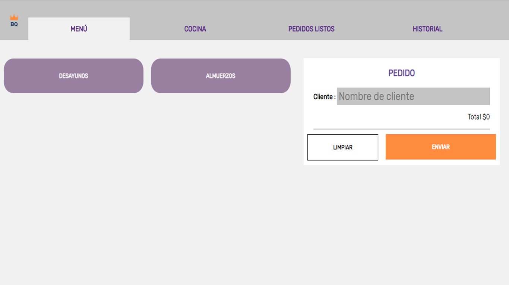
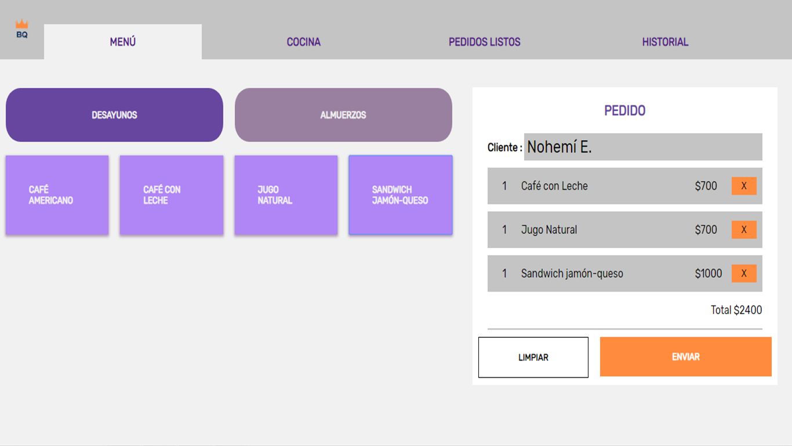
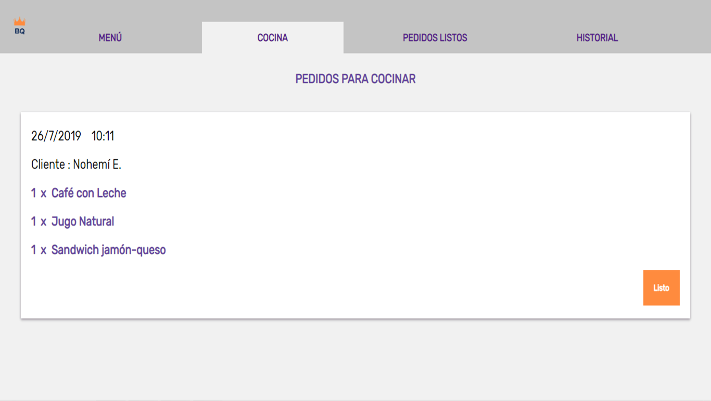
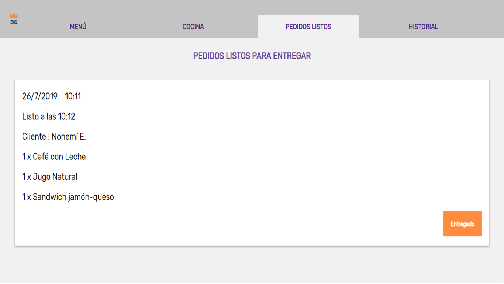
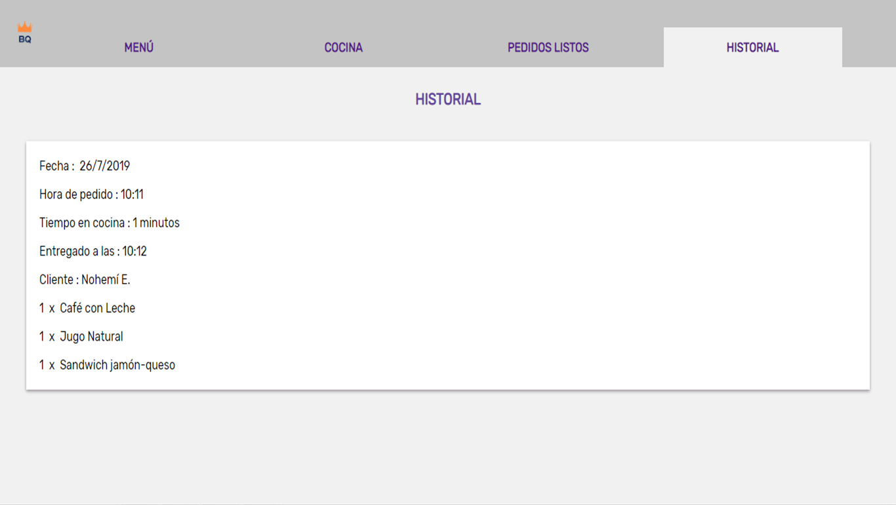
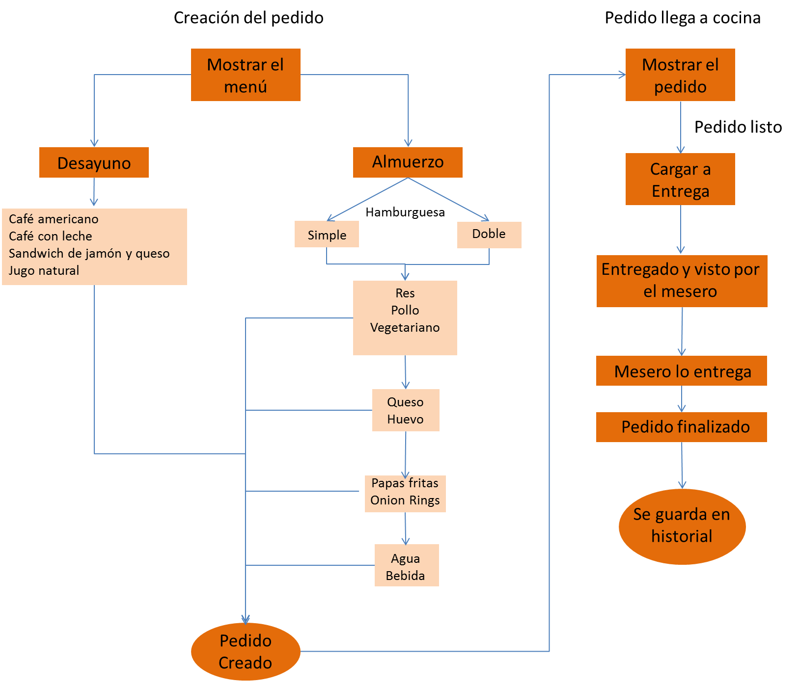
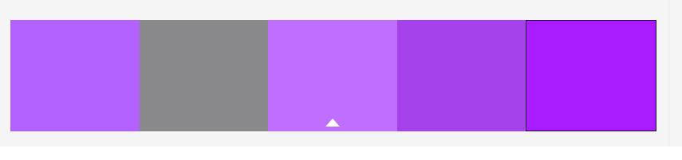

# Burger Queen 🍔 

## Introducción 📍 
 *Burguer Queen* es una interfaz que permite a un local de comida , atrás quedaron lapiz y papel para anotar las ordenes de los clientes ! . Con *Burguer Queen* podrás obtener de manera rapida el guardado de los pedidos de los clientes , mediante el mesero , quien utulizará la plataforma en la comodidad de un tablet o celular , puesto que *Burguer Queen* es *responsive* , lo que quiere decir que se adapta a cualquier dispositivo movil.

  

 ## Descripción 📜

 El uso de la plataforma es bastante fácil .
 En primer lugar tendremos nuestro dispositivo movil , donde mediante el mesero o quien se encargue de tomar los pedidos en su restaurant, se tomaran los pedidos de los clientes , otorgando los botones con las categorias deseadas .Luego de que se eliga la categoría , por ejemplo , desayuno , se desplegará las opciones de *desayuno , como café , sandiwich*, etc . Posteriormente al tocar la opcion deseada por el cliente se añadira a una cesta de pedidos de un cliente , luego de finalizado el pedido , el mesero ingresará elnombre del cliente y le dará enviar .

 

 
 

 Se enviará automaticamente ala cocina donde mediante la misma aplicación , en laopción de cocina , el cocinero podrá visualizar los pedidos ,la fecha , el nombre del cliente y lo pedido . Estos apareceran de manera ascendente , las primeras ordenes se caragaran al principio de la pagina , parapoder ser realizados antes . Se cargaran un maximo de 5 pedidos en la opción de cocina , y a medida que el cocinero entregué la información que esta listo el pedido , mediante el botón listo de cada pedido , se iran caragando mas pedidos , a medida que estos esten listos . 

 

 Después de los pedidos listos , el mesero podrá visualizar las ordenes listas en la opción ordenes de la misma interfaz y podrá así saber cuaeles ordenes estan listas , para posteriormente buscarlas  y entregarlas .

 

 
 

 En la ultima opción se podrá visualizar un registro de todos los pedidos hechos durante todo el día .

 

 ## Creando el proyecto 💡 

 ## Planificación 📌
  En primer lugar visualizamos una necesidad , la necesidad de crear una interfaz rapida y accesible . Y que se pueda manejar de manera simple para el pedido de ordenes.

### Planificación en conjunto 🗓

Para planificarnos utilizamos la plataforma *trello* .
La planificación incluyó , hacer historias de usuarios , las cuales se fueron completando a medida que avanzavamos .
Si quieres saber como fue nuestro proceso de planificación , te invitamos a ver nuestro trello  [*aquí*](https://trello.com/b/RrPYJSCT/burguer-queen)

### Diagrama de flujo
Nos muestra como el usuario de la plataforma interactua con ella.

### Prototipo de alta fidelidad  🖌 

Para tener una idea como va a quedar visualmente nuestra plataforma , ideamos este prototipo en *figma* que puedes ver [aquí]()

### Paleta de colores 🎨 

## Probando ...

Para ser más eficaz a la hora de testear nuestra aplicación además de hacer testeos manuales , y probar con los tests de React. Se hizo testeo con usuarios .

## Testeo con usuarios ✍

El testeo con usuarios incluyo además feedbacks hacía el producto , a continuación les dejamos un testeo real con un usuario , para escuchar el audio pincha [*aquí*](https://drive.google.com/file/d/1QtC0sxwA9o50F6iFUenDnI75X8EaDyNn/view)

## Tecnologías usadas para la creación de Burguer Queen 🖥

* Para esta plataforma usamos la biblioteca de programación de javascript 
[React](https://es.wikipedia.org/wiki/React)
versión 16.0.6.

* Testeamos nuestro código con testeos unitarios , para aquellos ocupamos [Enzyme](https://airbnb.io/enzyme/) , el que nos permitió testear componentes y pricipalmente botones y sus funcionalidades , detatectando así errores a tiempo .

* Nuestra interfaz esta hecha en tiempo real , para que las ordenes y se carguen de manera instantanea  , por lo que para almacenar estos datos [Firebase](https://es.wikipedia.org/wiki/Firebase) 6.3.1 . Especificamente el sistema de colección de data de firebase llamada [database](https://firebase.google.com/docs/database/?hl=es-419).

## Autoras 
 Hecho con mucho ❤ por :

 
 💻[Claudia Sirvent](https://github.com/Cloiw)

 💻[Marines Lemus](https://github.com/MarinesLemus007)

 💻 [Luisa Romero](https://github.com/luisaromero)

